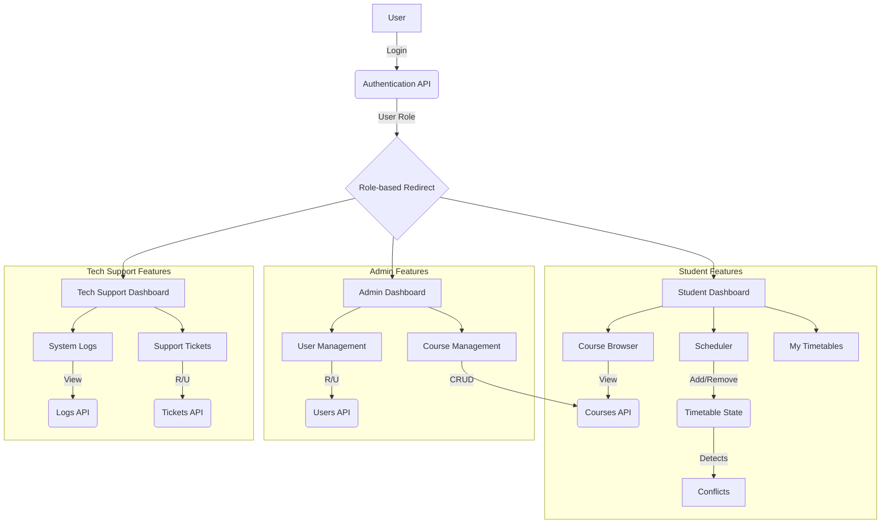

# CourseCraft: A Modern Course Scheduler

CourseCraft is a web-based application designed to help university students plan and manage their academic schedules. It provides an intuitive interface for browsing courses, creating timetables, and tracking academic progress.

---

## 1. Introduction

### 1.1 Purpose
This document provides a mini Software Requirements Specification (SRS) for the CourseCraft application. It outlines the main features, functionalities, and technical stack of the project.

### 1.2 Scope
The application allows students to:
- Authenticate to access their personal dashboard.
- View their academic profile and progress.
- Browse available courses and faculty members.
- Interactively create and visualize a course timetable for a semester.
- View and manage current and past timetables.

---

## 2. Overall Description

### 2.1 Product Features
The application is comprised of the following key features:

#### 2.1.1 User Authentication
- A secure login page for users to access the system.
- Pre-defined roles for students and administrators with hardcoded credentials for demonstration.
- Session management with a 15-minute inactivity timeout for security.
- Protected routes to ensure only authenticated users can access the dashboard and related pages.

#### 2.1.2 Student Dashboard
- A personalized landing page for students after login.
- Displays key student profile information (name, major, year).
- Shows academic progress, including completed credits vs. required credits.
- Provides "Quick Actions" for easy navigation to core application features.
- A user menu with a logout option.

#### 2.1.3 Interactive Course Scheduler
- A visual, drag-and-drop interface for building a weekly timetable.
- A filterable and searchable list of available courses.
- Real-time conflict detection to prevent overlapping classes.
- Credit-counting functionality with warnings for under/over-loading.
- Option to send the created timetable to the user's email.

#### 2.1.4 Course & Faculty Browser
- A dedicated page to view all available courses with details like description, department, and credits.
- A separate page to view a list of all faculty members, their departments, and the subjects they teach.

#### 2.1.5 Timetable Management
- A "My Timetables" page to view schedules from past semesters.
- Displays the current semester's timetable.
- Prompts the user to create a schedule if one for the current semester does not exist.

#### 2.1.6 Admin Dashboard
- **Course Management**: A table showing all courses, allowing admins to add, edit, or delete courses.
- **User Management**: Admins can view all users and manage their roles (e.g., promote a student to an admin).
- **Conflict Monitoring**: A read-only view that highlights potential scheduling conflicts, such as faculty double-bookings or high-conflict courses.

#### 2.1.7 Tech Support Dashboard
- **System Logs**: A read-only, real-time view of system event logs for debugging and monitoring.
- **Support Tickets**: Tech support staff can view, manage, and update the status of user-submitted support tickets.

---

## 3. Functional Requirements

| ID | Requirement | Description |
| :--- | :--- | :--- |
| FR-01 | User Login | Users must be able to log in with an email and password. The system shall authenticate them against stored credentials. |
| FR-02 | Role-Based Access | Upon login, the system shall redirect users to their specific dashboard (Student, Admin, or Techy) based on their role. |
| FR-03 | Session Persistence | User sessions shall be maintained, allowing users to remain logged in across browser sessions. |
| FR-04 | View Courses | Students shall be able to browse a list of all available courses, with filtering and search capabilities. |
| FR-05 | Drag-and-Drop Timetable | Students shall be able to add courses to their weekly schedule grid using a drag-and-drop interface. |
| FR-06 | Conflict Detection | The system shall automatically detect and visually indicate any time conflicts between courses in the student's timetable. |
| FR-07 | Credit Calculation | The system shall calculate and display the total credit load for the courses in the current timetable. |
| FR-08 | Admin Course CRUD | Admins shall be able to Create, Read, Update, and Delete courses in the course catalog. |
| FR-09 | Admin User Management | Admins shall be able to view and modify the roles of other users. |
| FR-10 | View System Logs | Tech support users shall be able to view a stream of system event logs. |
| FR-11 | Manage Support Tickets| Tech support users shall be able to update the status of support tickets. |

---

## 4. Non-Functional Requirements

| ID | Requirement | Description |
| :--- | :--- | :--- |
| NFR-01 | **Performance** | Page loads and data interactions should be responsive, with most operations completing in under 2 seconds. |
| NFR-02 | **Usability** | The interface shall be intuitive, modern, and easy to navigate for non-technical users. |
| NFR-03 | **Security** | The application must protect user routes from unauthorized access. A 15-minute inactivity timeout shall be enforced. |
| NFR-04 | **Responsiveness** | The application UI must adapt seamlessly to various screen sizes, including desktop, tablet, and mobile devices. |
| NFR-05 | **Maintainability**| The code shall be well-structured, using a component-based architecture and clear naming conventions to facilitate future development. |

---

## 5. Data Flow Diagram

---

## 6. Tech Stack

- **Framework:** Next.js (with App Router)
- **Language:** TypeScript
- **Styling:** Tailwind CSS
- **UI Components:** ShadCN/UI, Lucide React (for icons)
- **State Management:** React Context API (for authentication)
- **Authentication:** Client-side authentication with session management.

---

## 7. Getting Started

For instructions on how to set up the project for local development and deployment, please see [CONTRIBUTING.md](./CONTRIBUTING.md).
