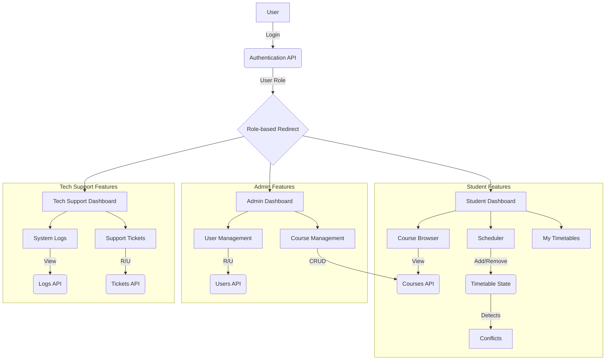

# Software Requirements Specification (SRS) for CourseCraft

## 1. Introduction

### 1.1 Purpose
This document provides a detailed Software Requirements Specification (SRS) for the CourseCraft application. It outlines the main features, user stories, functional and non-functional requirements, and system architecture.

### 1.2 Scope
The application allows users with different roles to interact with the university's course scheduling system.
- **Students** can authenticate, view their profile, browse courses, and build a visual timetable for the upcoming semester.
- **Administrators** can manage courses, users, and monitor for systemic scheduling conflicts.
- **Tech Support** can view system logs and manage support tickets.

---

## 2. User Stories

### As a Student, I want to:
- **US-01:** Log in securely to access my personal dashboard.
- **US-02:** See my academic profile, including my major, year, and progress toward graduation.
- **US-03:** Browse a list of all available courses, with the ability to filter by department and search by name or code.
- **US-04:** Add courses to a visual weekly calendar to build my timetable.
- **US-05:** Be warned if I add a course that conflicts with an existing one in my schedule.
- **US-06:** See my total credit load for the semester and be warned if it's too high or too low.
- **US-07:** View my timetables from previous semesters to see the courses I've taken.
- **US-08:** Send a copy of my final timetable to my email.

### As an Administrator, I want to:
- **US-09:** Log in to a dedicated admin dashboard.
- **US-10:** View, add, edit, and delete courses from the university catalog.
- **US-11:** View a list of all users and change their roles (e.g., promote a student to an admin).
- **US-12:** See a high-level overview of potential scheduling conflicts, like a professor being booked for two classes at once.

### As a Tech Support Staff, I want to:
- **US-13:** Log in to a dedicated tech support dashboard.
- **US-14:** View a real-time stream of system event logs to monitor for errors.
- **US-15:** View and update the status of user-submitted support tickets.

---

## 3. Functional Requirements

| ID | Requirement | Description |
| :--- | :--- | :--- |
| FR-01 | User Login | Users must be able to log in with an email and password. The system shall authenticate them against stored credentials. |
| FR-02 | Role-Based Access | Upon login, the system shall redirect users to their specific dashboard (Student, Admin, or Techy) based on their role. |
| FR-03 | Session Persistence | User sessions shall be maintained, allowing users to remain logged in across browser sessions. |
| FR-04 | View Courses | Students shall be able to browse a list of all available courses, with filtering and search capabilities. |
| FR-05 | Drag-and-Drop Timetable | Students shall be able to add courses to their weekly schedule grid using a drag-and-drop interface. |
| FR-06 | Conflict Detection | The system shall automatically detect and visually indicate any time conflicts between courses in the student's timetable. |
| FR-07 | Credit Calculation | The system shall calculate and display the total credit load for the courses in the current timetable. |
| FR-08 | Admin Course CRUD | Admins shall be able to Create, Read, Update, and Delete courses in the course catalog. |
| FR-09 | Admin User Management | Admins shall be able to view and modify the roles of other users. |
| FR-10 | View System Logs | Tech support users shall be able to view a stream of system event logs. |
| FR-11 | Manage Support Tickets| Tech support users shall be able to update the status of support tickets. |

---

## 4. Non-Functional Requirements

| ID | Requirement | Description |
| :--- | :--- | :--- |
| NFR-01 | **Performance** | Page loads and data interactions should be responsive, with most operations completing in under 2 seconds. |
| NFR-02 | **Usability** | The interface shall be intuitive, modern, and easy to navigate for non-technical users. |
| NFR-03 | **Security** | The application must protect user routes from unauthorized access. A 15-minute inactivity timeout shall be enforced. |
| NFR-04 | **Responsiveness** | The application UI must adapt seamlessly to various screen sizes, including desktop, tablet, and mobile devices. |
| NFR-05 | **Maintainability**| The code shall be well-structured, using a component-based architecture and clear naming conventions to facilitate future development. |

---

## 5. Data Flow Diagram

